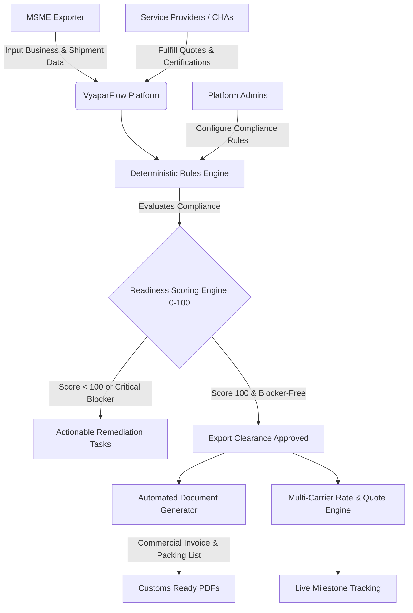

# VyaparFlow — Export Logistics Readiness Platform

> **Deterministic Export Compliance, Readiness Scoring & Multi-Carrier Logistics SaaS for Indian MSMEs**  
> *Pan-India Operating System for Global Trade Corridors (USA, EU, UAE, UK, ASEAN)*

---

## 🌟 Overview

**VyaparFlow** transforms complex, multi-agency cross-border export workflows into a deterministic, step-by-step digital operating system. Designed specifically for Indian Micro, Small, and Medium Enterprises (MSMEs), VyaparFlow eliminates costly customs rejections, documentation errors, and shipment delays by evaluating end-to-end export readiness before cargo leaves the factory gate.

---

## 🏗️ System Architecture



---

## 🎯 Key Features & Modules

### 1. 📊 Deterministic Readiness Scoring Engine (0–100)
- **Mathematical Transparency**: Avoids non-deterministic AI hallucination in regulatory compliance.
- **5-Pillar Weighted Evaluation**:
  - **Business Entity Readiness (20%)**: GST, IEC, Business registration validity.
  - **Trade Documentation (25%)**: Commercial invoices, packing lists, shipping bills, certificates of origin.
  - **Mandatory Certifications (20%)**: Product-country specific certifications (e.g., APEDA, FSSAI, Phytosanitary).
  - **Packaging & Labelling (15%)**: Destination-specific packaging, palletization, and language regulations.
  - **Logistics & Carrier Readiness (20%)**: Final booking confirmation, container allocation, dispatch readiness.
- **Critical Dispatch Blockers**: Mandatory missing prerequisites instantly throttle the dispatch status regardless of raw aggregate score.

### 2. 📑 Automated Export Document Engine
- Server-side PDF generation for **Commercial Invoices** and **Packing Lists** with automated HS code lookup, INR/USD/EUR currency handling, and standard invoice nomenclature.

### 3. 🚢 Multi-Carrier Freight Rate Engine
- Instant rate and transit time comparisons across air, ocean (FCL/LCL), and road modes.
- Transparent breakdowns of port handling charges, customs clearance (CHA), fuel surcharges, and exclusions.

### 4. 📍 Milestone Tracking & Audit Trail
- Real-time timestamped event stream from factory pickup, CFS/ICD arrival, customs clearance, vessel loading, to destination delivery.

### 5. 👥 Multi-Stakeholder Role Architecture
- **MSME Exporters**: End-to-end dashboard, product catalog, compliance checklists, document generation, and quote acceptance.
- **Service Providers (CHA / Freight Forwarders / Labs)**: Submit bids, review documents, issue certifications, and log milestones.
- **Platform Admins**: Live compliance rules configurator, country-product requirement mapping, and audit logging.

---

## 📂 Project Directory Structure

```text
VyaparFlow/
├── app/                        # Next.js 16 App Router (Routes & Server Actions)
│   ├── actions.ts              # Type-safe Server Actions for mutations
│   ├── layout.tsx              # Root HTML Layout, Fonts & Metadata
│   ├── globals.css             # Tailwind CSS tokens and themes
│   ├── page.tsx                # Landing Page & Solution Overview
│   ├── login/                  # Multi-persona Authentication & Account Switcher
│   ├── dashboard/              # MSME Operational Command Center
│   ├── business/               # Business Profile, GST/IEC Verification
│   ├── products/               # Product Catalog & HS Code Mapping
│   ├── readiness/              # 5-Pillar Export Readiness Audit & Scorers
│   ├── documents/              # Export Documentation Vault & PDF Viewer
│   ├── certifications/         # Mandatory Trade Certificates Manager
│   ├── packaging/              # Packaging & Labelling Compliance Checklists
│   ├── shipments/              # Shipment Booking, Quotes & Milestone Tracking
│   ├── provider/               # Freight Forwarder & CHA Bid Portal
│   ├── admin/                  # Compliance Rules Configurator & Audit Logs
│   └── api/                    # REST Endpoints (PDF Stream, GST Sandbox proxy)
├── components/                 # Reusable UI & Client Components
│   ├── Navbar.tsx              # Global Navigation with Active Persona Switcher
│   ├── LoginForm.tsx           # Authentication Form
│   ├── RegisterForm.tsx        # Registration with Persona Role Selector
│   ├── BusinessRegistrationsForm.tsx # GST/IEC Form with Live Validation
│   └── GSTLookupButton.tsx     # GSTIN Auto-fetch Button with Feedback
├── lib/                        # Core Domain Logic & Utilities
│   ├── prisma.ts               # Prisma Client Singleton & Connection Pool
│   ├── recentAccounts.ts       # Client-side multi-account switcher utility
│   ├── businessTypeConfig.ts   # Business entity registration rules
│   └── services/
│       ├── readiness.ts        # Deterministic Scoring & Blocker Calculations
│       ├── documentGenerator.ts# jsPDF-based Trade Document Generator
│       └── sandboxGst.ts       # Sandbox.co.in GST API client with offline fallback
├── prisma/                     # Database Layer
│   ├── schema.prisma           # Prisma Data Model (12 Relational Entities)
│   └── seed.ts                 # Golden Demo Seed Data (Agro & Industrial Exports)
├── public/                     # Static Assets & Storage
│   └── uploads/                # Local runtime upload destination (.gitkeep)
├── __tests__/                  # Unit & Integration Test Suites
│   ├── readiness.test.ts       # Readiness Scorer & Blocker Unit Tests
│   └── services.test.ts        # Database & Service Integration Tests
├── .env.example                # Environment variables template
├── jest.config.js              # Jest configuration for TypeScript
├── package.json                # Project dependencies & scripts
└── tsconfig.json               # TypeScript compiler options
```

---

## 🛠️ Tech Stack

- **Framework**: [Next.js 16 (App Router)](https://nextjs.org/) + [React 19](https://react.dev/)
- **Language**: [TypeScript 5](https://www.typescriptlang.org/)
- **Styling**: [Tailwind CSS 4](https://tailwindcss.com/)
- **ORM & Database**: [Prisma ORM 5](https://www.prisma.io/) with SQLite (configurable to PostgreSQL)
- **PDF Generation**: [jsPDF](https://github.com/parallax/jsPDF) + [jspdf-autotable](https://github.com/simonbengtsson/jsPDF-AutoTable)
- **Charts & Visualizations**: [Recharts](https://recharts.org/)
- **Icons**: [Lucide React](https://lucide.dev/)
- **Testing**: [Jest](https://jestjs.io/) + [ts-jest](https://kulshekhar.github.io/ts-jest/)

---

## 🚀 Quick Start Guide

### Prerequisites
- **Node.js**: `v20.x` or higher
- **npm**: `v10.x` or higher

### 1. Clone & Install Dependencies
```bash
git clone https://github.com/Sidd-commits/VyaparFlow.git
cd VyaparFlow
npm install
```

### 2. Configure Environment Variables
Copy `.env.example` to create your local `.env`:
```bash
cp .env.example .env
```

### 3. Initialize & Seed Database
Synchronize the Prisma schema and seed golden demo records:
```bash
# Push schema to SQLite
npx prisma db push

# Populate with demo dataset
npx prisma db seed
```

### 4. Start Development Server
```bash
npm run dev
```
Open [http://localhost:3000](http://localhost:3000) in your browser.

---

## 🧪 Running Automated Tests

Run the full unit and service integration test suite:
```bash
# Run tests once
npm test

# Run tests in watch mode
npm run test:watch
```

---

## 🔑 Demo Personas & Credentials

The platform includes test credentials to evaluate all three core workflows:

| Persona | Email | Password | Primary Role & Workflow |
| :--- | :--- | :--- | :--- |
| **MSME Exporter** | `msme@apex-exports.com` | `password123` | Apex Agro Processing & Exports — Mango pulp export to UAE |
| **Logistics / CHA Provider** | `provider@freight.com` | `password123` | SwiftGlobe Freight — Quote submission & milestone updates |
| **Platform Administrator** | `admin@vyaparflow.com` | `password123` | Compliance Officer — Rules configurator & audit log viewer |

---

## 🔒 Security & Contribution Guidelines

- **Never commit `.env` or sensitive API keys**: Use [.env.example](.env.example) as reference.
- **Never commit SQLite database binaries (`*.db`)**: Always use `npx prisma db seed` for reproducible state.
- **Clean builds**: Ensure `npm test` and `npm run build` pass before submitting pull requests.
